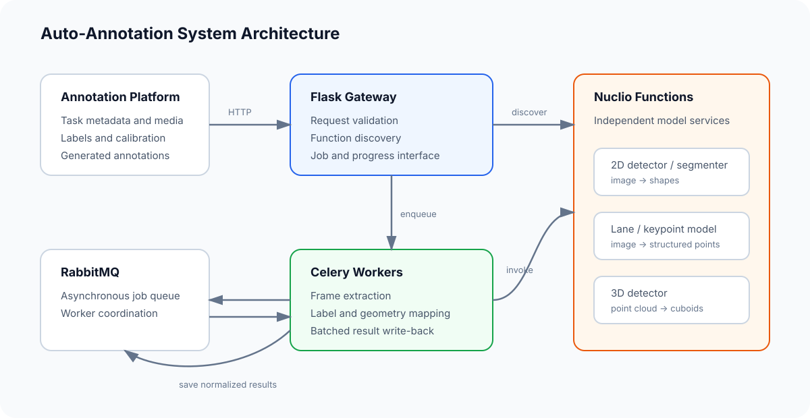
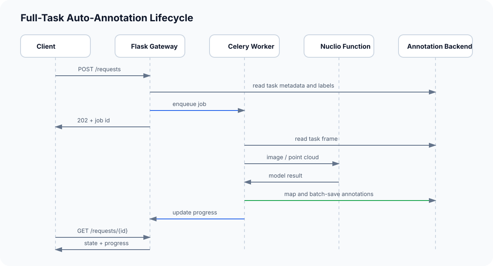

# Auto-Annotation Orchestrator

A server-side orchestration layer that connects annotation tasks with independently deployed Nuclio inference functions. The service retrieves task media, dispatches model inference, maps model labels to task labels, tracks asynchronous progress, and writes normalized results back to the annotation platform.

The repository contains the workflow layer. Model implementations and their Nuclio deployment definitions live in [Serverless Inference Foundry](https://github.com/RocketWill/serverless-inference-foundry).



## What it does

- Discovers deployed Nuclio functions and reads their model metadata.
- Runs synchronous inference for a selected frame.
- Queues full-task auto-annotation jobs through Celery and RabbitMQ.
- Extracts frames from image sets, video chunks, and point-cloud tasks.
- Maps model classes to the labels configured in an annotation task.
- Normalizes detector output before saving annotations in batches.
- Reports task progress and supports job cancellation.
- Projects 3D cuboids into configured 2D camera views when calibration data is available.

## System responsibilities

| Module | Responsibility |
| --- | --- |
| Flask gateway | Validates requests and exposes function and job endpoints. |
| Nuclio adapter | Lists functions, reads metadata, and invokes a selected inference function. |
| Annotation adapter | Reads task information and writes or removes generated annotations. |
| Celery worker | Processes complete annotation tasks outside the HTTP request lifecycle. |
| Frame provider | Reads frames from image, video, or point-cloud task storage. |
| Result mapper | Converts model labels and geometry into the annotation platform schema. |
| Projection tools | Projects supported 3D cuboids into 2D camera views. |

## Request lifecycle



Two execution paths are available:

- **Single-frame inference** retrieves one frame, invokes the selected Nuclio function, applies label mapping, and returns the result directly.
- **Full-task annotation** creates a Celery job, processes each frame, periodically writes generated annotations, and exposes progress through the job endpoints.

## HTTP interface

The Flask blueprint is mounted at `/api/v1/lambda`.

| Method | Path | Purpose |
| --- | --- | --- |
| `GET` | `/functions` | List Nuclio functions available to the configured project. |
| `GET` | `/functions/{function_id}` | Read metadata for one function. |
| `POST` | `/functions/{function_id}` | Run inference for one frame. |
| `GET` | `/requests` | List active and reserved annotation jobs. |
| `POST` | `/requests` | Queue a full-task annotation job. |
| `GET` | `/requests/{job_id}` | Read job state and progress. |
| `DELETE` | `/requests/{job_id}` | Cancel an annotation job. |
| `DELETE` | `/delete/{task_id}` | Remove generated annotations for a task. |

### Queue a task

```json
{
  "task": 42,
  "function": "pth-detector-coco",
  "mapping": {
    "car": "vehicle",
    "person": "pedestrian"
  },
  "threshold": 0.6,
  "cleanup": false
}
```

The annotation platform remains responsible for task storage and the final annotation schema. Nuclio functions remain responsible for model loading, preprocessing, inference, and model-specific postprocessing.

## Repository structure

```text
app/
├── dockerfiles/                 # Container entrypoint and legacy image recipe
├── project/server/
│   ├── lambda_manager/
│   │   ├── functions.py         # Flask routes and job creation
│   │   ├── views.py             # Nuclio and annotation adapters
│   │   ├── tasks.py             # Celery auto-annotation workflow
│   │   ├── frame_provider.py    # Media access
│   │   └── tools/projection/    # 3D-to-2D projection utilities
│   ├── celery_conf.py
│   └── config.py
├── env.example.sh
└── requirements.txt
scripts/
├── run_rabbitmq.sh
└── run_server.sh
```

## Configuration

Copy the example environment file and update the endpoints for your deployment:

```bash
cp app/env.example.sh app/env.sh
```

The main settings are:

- `CELERY_WORKER` and `CELERY_BACKEND`
- `NUCLIO_PROJECT_NAME`, `NUCLIO_HOST`, and `NUCLIO_PORT`
- `ANNOSERVER_HOST` and `ANNOSERVER_PORT`
- Gunicorn worker, timeout, and logging settings

No model weights are stored in this repository.

## Running the reference setup

1. Start RabbitMQ:

   ```bash
   bash scripts/run_rabbitmq.sh
   ```

2. Prepare `app/env.sh` from the example configuration.
3. Deploy at least one compatible function from [Serverless Inference Foundry](https://github.com/RocketWill/serverless-inference-foundry).
4. Provide an annotation backend that implements the task and annotation endpoints used by `AnnotationGateway`.
5. Start the Flask gateway and Celery worker through the container entrypoint or an equivalent local environment.

The dependency set reflects the original Python 3.8-era environment. The included Docker recipe references a legacy base image and may need to be replaced for a new deployment.

## Verification scope

The repository includes a basic Flask route test and can be checked with:

```bash
cd app
pytest project/tests
```

End-to-end verification additionally requires RabbitMQ, an annotation backend, Nuclio, compatible model functions, task media, and model weights. The code should therefore be treated as a reference implementation unless those external services are configured.

## License

See [LICENSE](LICENSE). Model frameworks and related upstream code used by separately deployed functions retain their respective licenses.
